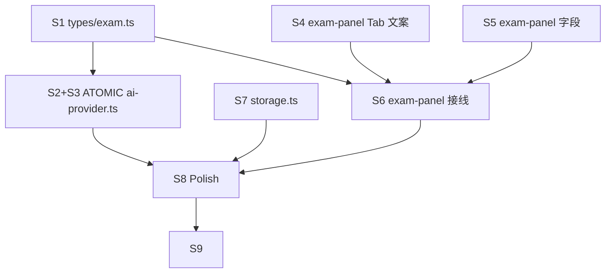

# Initial User Prompt

> 移除 Gemini 调用模式。原本 Gemini 模式增加 Anthropic 协议接入。
> 测试凭据：
> - sk: `sk-l5xn…DhCMU`（脱敏占位；完整凭据仅在本地环境使用，禁止入库）
> - baseURL: `https://aigw.c5y.moe`

# Description

本项目是一个跑在国家开放大学考试页面上的 Tampermonkey 油猴脚本，面板提供 AI 自动答题能力，当前有 OpenAI 与 Gemini 两个 Provider Tab。Gemini 分支实际已无人使用：脚本使用者目前持有的是 Anthropic 协议凭据（Anthropic 风格 `sk-...`），并经过自有反代网关 `https://aigw.c5y.moe` 对外暴露 Anthropic Messages API。因此该 Gemini Tab 既无法服务真实用户，又增加 UI 噪声和分支维护负担。

本任务把"第二个 Provider 槽位"从 Gemini **整体平移替换**为 Anthropic：面板第二个 Tab 改名为 "Anthropic"，对应的模型、API Key、Base URL 三个字段、保存/回填、答题调用、视觉（图片题）消息构建、错误显示、默认值全部以 Anthropic 形态实现。OpenAI 分支保持不动；题目抽取与填写逻辑保持不动；Tampermonkey `@connect *` 元数据不变。残留的旧 `provider === 'gemini'` 本地配置**沿用第二槽位身份平移为 `'anthropic'`**（保留用户在该槽位填的 customPrompt/concurrency 等 provider-agnostic 字段；apiKey 与 apiBaseUrl 因协议形态完全不同而清空、由用户重新填写）；加载行为不写回 storage，避免一次读取破坏用户原始数据。

主要受益方是脚本使用者（持有 Anthropic 协议凭据者，AI 答题首次真正可用）与脚本维护者（更少分支、更少误配置风险）。关键约束：用户可填写的 Base URL 不被写死（既能用反代如 `https://aigw.c5y.moe`，也能改成 `https://api.anthropic.com`）；测试用 sk 不得进入代码默认值、git、日志或 placeholder；构建/类型/静态检查必须全部通过。具体的 Anthropic 默认模型 ID 以技术研究阶段（Phase 2a）的推荐为准，业务侧只要求"默认值合理 + 用户可改"。

**Scope**:
- Included：
  - 面板第二个 Tab 重命名为 "Anthropic"，移除任何标题/字段/注释中的 "Gemini" 残留
  - Anthropic Tab 字段：模型名、API Key（password 类型）、Base URL（默认 `https://aigw.c5y.moe`）、错误显示位
  - 配置保存 / 跨会话回填
  - AI 答题在 Anthropic Provider 下覆盖单选、多选、判断、填空、简答、匹配 6 种题型
  - 图片题（Vision）走 Anthropic 视觉协议要求的裸 base64 形态
  - 老 `provider === 'gemini'` 本地配置**平移为 `'anthropic'`**（沿用第二槽位身份；apiKey/apiBaseUrl 清空待用户重填）
- Excluded：
  - OpenAI Provider 分支的任何改动
  - 题目抽取 / 填写流程改动
  - 引入官方 Anthropic SDK（继续走 fetch / GM_xmlhttpRequest）
  - 流式输出、prompt caching、extended thinking、tool use
  - 新增第三个 Provider
  - 修改 UserScript `@connect *` 白名单

**User Scenarios**:
1. **Primary Flow**：使用者打开考试页 → 面板显示 OpenAI 与 Anthropic 两个 Tab → 切到 Anthropic Tab → 填写模型、API Key、Base URL → 保存 → 点"开始 AI 答题" → 6 种题型与图片题均成功返回可解析答案 → 关闭页面后再次打开，字段自动回填。
2. **Alternative Flow**：将 Base URL 改为官方端点（如 `https://api.anthropic.com`），其余流程不变。
3. **Error Handling**：网关返回 4xx/5xx 或非 JSON 错误页时，面板在 Anthropic Tab 下方显示原始错误片段的前 200 字符；未填写 API Key 即触发答题时，给出与 OpenAI 分支一致风格的提示；本地存有旧 `provider === 'gemini'` 配置时，加载不抛异常，**当前 Provider 平移为 Anthropic（沿用第二槽位）**，旧 apiKey/baseURL 不复用为 Anthropic 凭据（协议形态不同，必须由用户重新填入 Anthropic 形态的凭据）。

## Acceptance Criteria

### Functional Requirements

- [ ] **AC1 — Tab 替换**：移除 Gemini，第二个 Tab 显示 Anthropic
  - Given: 使用者打开任一国开考试页并触发面板渲染
  - When: 面板完成初始渲染
  - Then: Provider Tab 列表的第二个 Tab 文字为 "Anthropic"；面板中不存在任何文字为 "Gemini" 的 Tab 或字段标签

- [ ] **AC2 — Anthropic Tab 字段齐全**
  - Given: 使用者切到 Anthropic Tab
  - When: Tab 内容渲染完成
  - Then: 出现三个输入字段——模型名、API Key（input type 为 password）、Base URL（默认值为 `https://aigw.c5y.moe`）——以及一个错误显示位；错误显示位在调用失败时呈现网关原始返回的前 200 字符

- [ ] **AC3 — 配置跨会话回填**
  - Given: 使用者在 Anthropic Tab 填写并保存了模型、API Key、Base URL
  - When: 关闭页面后重新打开同一考试页
  - Then: Anthropic Tab 的三个字段自动回填为上次保存的值

- [ ] **AC4 — 六种题型 Happy Path**
  - Given: Anthropic Tab 已配置可用凭据，当前页面包含单选、多选、判断、填空、简答、匹配题
  - When: 使用者点击"开始 AI 答题"，系统对每道题调用 Anthropic Provider
  - Then: 每种题型至少各有一道题在 happy path 下返回可被脚本解析为预期答案结构的内容（手测验收）

- [ ] **AC5 — 图片题 Vision 通道**
  - Given: 当前页面存在一道含图片的题目，且使用者启用了 Vision
  - When: 系统构造该题对应的 Anthropic 请求体
  - Then: 请求中携带的图片以 Anthropic 视觉协议要求的裸 base64 形态发送，base64 数据**不包含** `data:image/...;base64,` 前缀

- [ ] **AC6 — 老 Gemini 配置平移到 Anthropic**
  - Given: 本地存储中存在 `provider === 'gemini'` 的旧配置（含旧的 apiKey/baseURL）
  - When: 使用者重新打开面板
  - Then: 面板加载不抛异常；当前选中的 Provider 平移为 Anthropic（沿用"第二槽位"身份）；apiKey 与 apiBaseUrl 被清空为 Anthropic 默认（用户须重新填入 Anthropic 形态的凭据，避免把 Google Key 当 Anthropic Key 使用）；customPrompt 与 concurrency 等 provider-agnostic 字段保留

- [ ] **AC7 — 代码内 Gemini 残留清理**
  - Given: 当前修改完成的代码库
  - When: 在 `src/` 下执行 `grep -ri 'gemini' src/`
  - Then: 命中 0 行（不包含变量名、Tab 文案、注释、测试 fixture）

- [ ] **AC8 — UserScript @connect 不变**
  - Given: UserScript 元数据块
  - When: 检查元数据
  - Then: `@connect *` 保持不变，不新增任何 host 白名单条目

- [ ] **AC9 — 构建 / 类型 / 静态检查通过**
  - Given: 修改完成的代码库
  - When: 依次执行 `pnpm run typecheck`、`pnpm run lint`、`pnpm run build`
  - Then: 三条命令均退出码 0

### Non-Functional Requirements

- [ ] **AC10 — Performance**：Anthropic Provider 单题 happy-path 端到端耗时 < 30 秒；并发数取自现有配置（1–20），不在本任务中调整

- [ ] **AC11 — Security**：测试用 sk（`sk-l5xn…DhCMU`）以**完整明文**形式不得出现在 git 提交内容、代码默认值、placeholder、运行时日志、文档或 scratchpad 中；如需提及只能使用脱敏形式

### Definition of Done

- [ ] 全部 AC1–AC11 通过
- [ ] 手工验证：在 `https://aigw.c5y.moe` + 本地 sk 下完成一次 6 题型 + 1 图片题答题
- [ ] 旧 `provider === 'gemini'` 配置注入后页面不报错（控制台 0 异常）
- [ ] 代码评审完成


---

## Architecture Overview

### Solution Strategy

整体策略为**就地替换（in-place substitution）**：不引入新文件、不引入新抽象层，把 `gemini` 分支在 `ai-provider.ts` / `exam-panel.ts` / `types/exam.ts` / `storage.ts` 4 个文件中的代码块整体删除并替换为 Anthropic 等价物。当前仅 2 个 Provider，引入 ProviderRegistry/抽象类会增加阅读成本而无对应收益；最小改动面也直接对应 AC9（typecheck/lint/build 全绿）的最低破坏面。

协议层选择 **Anthropic Messages API 原生协议**（`POST {base}/v1/messages`），而非 OpenAI-compatible shim：用户网关 `aigw.c5y.moe` 已按 Messages API 设计、用户测试凭据是 Anthropic 风格 `sk-...` 配合 `x-api-key` 头、视觉协议差异显著（裸 base64 vs data URL）不能被 shim 屏蔽。HTTP 客户端与 OpenAI 路径对称，使用原生 `fetch`，默认携带 `anthropic-dangerous-direct-browser-access: true` 头（对反代无副作用，对官方直连必需）。CORS 失败时的 `GM_xmlhttpRequest` 回退路径仅记录在 SKILL 文档，本任务不预先实现。

`max_tokens` 默认 **2048**（答题场景留足余量，不暴露成 UI 字段，保持 UI 与 OpenAI Tab 对称）。视觉消息严格按 `{type:'image', source:{type:'base64', media_type, data}}` 形态，data 是剥离 `data:image/...;base64,` 前缀后的纯 base64。老 `provider === 'gemini'` 在 `getExamConfig()` 加载侧**平移为 `'anthropic'`**（沿用第二槽位身份，体现"槽位整体替换"语义），同时把 apiKey 清空、apiBaseUrl 重置为 Anthropic 默认（`https://aigw.c5y.moe`）—— 避免把 Google Key 当 Anthropic Key 发出；保留 customPrompt 与 concurrency 等 provider-agnostic 字段；该函数**不写回 storage**——读一次配置不应破坏用户原始数据。

### Key Architectural Decisions

| # | Decision | Alternatives Considered | Trade-off |
|---|----------|------------------------|-----------|
| D1 | Anthropic Messages API 原生协议（非 OpenAI-compatible 路径） | OpenAI-compatible proxy / 官方 `@anthropic-ai/sdk` | 用户须填裸 base 域名而非完整 endpoint；换得协议与官方完全一致、可直接切换 `https://api.anthropic.com`，且视觉协议差异不会被 shim 误处理 |
| D2 | 原生 fetch；GM_xhr 回退路径仅 SKILL 文档化 | 上来就用 `GM_xmlhttpRequest` | 与 OpenAI 路径对称、易调试；CORS 风险靠 `anthropic-dangerous-direct-browser-access` 头 + 反代域名收口 |
| D3 | baseURL 用户填 base，代码拼 `/v1/messages` | 让用户填完整 endpoint URL | 易用性高、出错率低；切到 Bedrock/Vertex 这类不同 path 网关需改代码（Out of Scope） |
| D4 | `max_tokens` 默认 2048，不暴露 UI 字段 | 暴露字段 / 默认 1024 / 默认 4096 | 单题足够覆盖简答+多选解释而不被截断；UI 保持简洁与 OpenAI Tab 对齐 |
| D5 | 老 `'gemini'` 存储 → 平移为 `'anthropic'` + 清空 apiKey/apiBaseUrl | 降级回 OpenAI / 保留 apiKey 复用 | 沿用第二槽位身份，符合"整体替换"语义；零误投递风险（Google Key 不会被发到 Anthropic）；保留 customPrompt 与 concurrency 等 provider-agnostic 字段 |
| D6 | 默认携带 `anthropic-dangerous-direct-browser-access: true` | 仅非反代时携带 / 让用户勾选 | 对反代无副作用、对官方直连必需；Tampermonkey 环境本就是"危险直连"，与 SKILL 推荐一致 |

### Expected Changes

**Modify** (4 files):
- `src/types/exam.ts:14-21` — `ExamConfig.provider` 联合类型 `'openai' | 'gemini'` → `'openai' | 'anthropic'`
- `src/modules/exam/ai-provider.ts:91-106, 147-172, 262-278` — 删除 `buildGeminiVisionParts` 与 `callGemini`，新增 `buildAnthropicVisionContent` 与 `callAnthropic`，dispatcher 分支由 `else if (provider === 'gemini')` 改为 `else if (provider === 'anthropic')`
- `src/modules/exam/exam-panel.ts:140-260`（连续 range） — Tab DOM、字段 id（`*-gemini` → `*-anthropic`）、placeholder、默认值（Base URL 默认 `https://aigw.c5y.moe`，默认模型 `claude-sonnet-4-5`）、Tab 切换 handler、`getConfigFromPanel` 类型注解、初始化时按 `config.provider` 选 tab
- `src/utils/storage.ts:132-152` — `getExamConfig` 默认值与旧 `'gemini'` 平移逻辑

**Create**: 无新文件

**Delete** (function-level / DOM-block-level only): `buildGeminiVisionParts`、`callGemini`、Gemini Tab DOM 块与对应 placeholder/默认 URL

**Leave alone**: `tsup.config.ts`、UserScript `@connect *` 元数据、`src/utils/dom.ts`、`src/modules/exam/question-extract.ts`、`src/modules/exam/answer-fill.ts`、OpenAI 分支

### Components & Contracts

新增函数签名：

```ts
/** 构造 Anthropic 视觉消息 parts（裸 base64 + media_type） */
function buildAnthropicVisionContent(
  textContent: string,
  imageBase64List: string[],
): Array<
  | { type: 'text'; text: string }
  | { type: 'image'; source: { type: 'base64'; media_type: string; data: string } }
>;

/** 调 Anthropic Messages API（{base}/v1/messages，原生 fetch） */
async function callAnthropic(
  config: ExamConfig,
  systemPrompt: string,
  userContent:
    | string
    | Array<{ type: 'text'; text: string } | { type: 'image'; source: { type: 'base64'; media_type: string; data: string } }>,
): Promise<string>;
```

**Provider dispatch**：保持现有 `if/else if` 链（仅 2 个分支，不引入 switch / registry）。

**类型契约**：`ExamConfig.provider: 'openai' | 'anthropic'`。

**Request body shape**：
```json
{ "model": "<config.modelName>", "max_tokens": 2048, "system": "<systemPrompt>",
  "messages": [{ "role": "user", "content": "<string | parts[]>" }] }
```

**Response parse**：`response.content[0].text`。

**协议细节由实现层负责**：业务层 AC 描述（裸 base64、password input、`grep`）刻意保留为黑盒契约；具体 header 拼装、URL trim、JSON body 构造等在 `callAnthropic` 内封装。

### Backward Compatibility

老 localStorage 配置迁移流程（在 `getExamConfig()` 加载时执行，**不写回 storage**）：

```ts
if (raw?.provider === 'gemini') {
  return {
    provider: 'anthropic',
    modelName: 'claude-sonnet-4-5',
    apiKey: '',
    apiBaseUrl: 'https://aigw.c5y.moe',
    customPrompt: typeof raw.customPrompt === 'string' ? raw.customPrompt : '',
    concurrency: Number.isFinite(raw.concurrency) && raw.concurrency >= 1 ? raw.concurrency : 3,
  };
}
```

同时兼容 `provider === 'anthropic'`（新增、原样返回）和 `provider === 'openai'`（保留、原样返回）。读一次不持久化，用户下次主动保存才落盘——避免一次访问就破坏用户数据。Anthropic 默认值（`claude-sonnet-4-5` / `https://aigw.c5y.moe`）与首次访问的默认值保持一致；apiKey 强制清空，因为 Google Gemini 凭据（`AIza...`）协议形态与 Anthropic（`x-api-key` + `sk-...`）完全不同，复用毫无意义且可能投递到错误网关。

### Risks & Mitigations

| Risk | Mitigation |
|------|------------|
| 浏览器 / Tampermonkey 下 CORS 拦截官方 Anthropic 端点 | 默认携带 `anthropic-dangerous-direct-browser-access: true`；SKILL 文档化 `GM_xmlhttpRequest` 回退路径（原生 fetch 抛 TypeError 时回退；HTTP 4xx/5xx 不回退） |
| 默认模型 `claude-sonnet-4-5` 被下线/改名 | 仅作 placeholder/默认值，不写死 enum；错误信息透传前 200 字便于用户察觉；自动 fallback 列入 Out of Scope |
| 老用户 Gemini 存储中 apiKey/baseURL 被误投递为 Anthropic 凭据 | 加载侧平移到 Anthropic 槽位但清空 apiKey/apiBaseUrl，重置为 Anthropic 默认；不立即持久化 |
| TypeScript 全仓 `'gemini'` 字面量窄化引用未清理 | `pnpm run typecheck` 兜底（AC9） |
| base64 前缀剥离失败 | sanitize 失败的图片整张跳过，与 OpenAI 路径行为一致 |
| 用户在 Base URL 字段填了带 `/v1/messages` 后缀的完整 URL | 拼接前 `replace(/\/+$/,'')`；如出现重复 path 由错误信息暴露给用户 |

### Out of Scope (Architecture-level)

- SSE 流式输出
- prompt caching / extended thinking / tool use
- 第三个 Provider 抽象层
- `GM_xmlhttpRequest` 路径预先实现（仅 SKILL 文档化）
- 模型 ID 自动 fallback（401/404 model_not_found → 上一代 ID）——记录为未来工作
- AC10 性能阈值自动化测量（留 Phase 6 verifications）
- AC4 每题型最小判定自动化（留 Phase 6 verifications）

### References

- Skill: `.claude/skills/anthropic-provider/SKILL.md`
- Codebase Analysis: `.specs/analysis/analysis-replace-gemini-with-anthropic.md`
- Architecture Scratchpad: `.specs/scratchpad/60547182f7c7b085.md`

---

## Phase 2b Codebase Reference

**Analysis Date**: 2026-05-15  
**Analyzer**: sdd:code-explorer (replacement implementation)

### Key Findings

**Files to Modify**: 3
- `src/types/exam.ts` (line 15: type union)
- `src/modules/exam/ai-provider.ts` (lines 91-106, 147-172, 167, 269, 271-274)
- `src/modules/exam/exam-panel.ts` (lines 143, 193, 214, 217-228, 265-267)

**Functions to Delete**: 2
- `buildGeminiVisionParts()` (ai-provider.ts:91-106)
- `callGemini()` (ai-provider.ts:147-172)

**Functions to Create**: 2
- `buildAnthropicVisionContent()` - Anthropic vision message format builder
- `callAnthropic()` - Anthropic API caller with Messages API

**Type Changes**: 1
- `ExamConfig.provider`: `'openai' | 'gemini'` → `'openai' | 'anthropic'`

**UI Elements to Replace**: 1 tab + 3 field groups
- Tab button: "Gemini" → "Anthropic"
- Field IDs: `*-gemini` → `*-anthropic`
- Placeholders: Gemini-specific → Anthropic-specific
- Default values: Gemini defaults → Anthropic defaults

**Risk Level**: **Medium**
- High: Type union change + dispatcher condition + storage migration
- Medium: Vision content format difference + API endpoint/auth difference
- Low: UI string replacements

**Integration Points** (3 critical):
1. **Type System** (exam.ts:15) → breaks TypeScript if not updated everywhere
2. **API Dispatcher** (ai-provider.ts:262-278) → routes requests to correct provider
3. **Storage Migration** (storage.ts:132-151) → handles old Gemini configs gracefully

### Reference Documents

- **Full Analysis**: `.specs/analysis/analysis-replace-gemini-with-anthropic.md`
- **Scratchpad**: `.specs/scratchpad/b3d6abb2c43a956c.md`

### Verification Checklist

- [ ] `pnpm run typecheck` passes
- [ ] `pnpm run lint` passes
- [ ] `grep -r 'gemini' src/` returns empty
- [ ] `pnpm run build` succeeds
- [ ] Manual test: Anthropic tab renders correctly
- [ ] Manual test: Valid API key → question answered
- [ ] Manual test: Invalid key → "Anthropic ..." error shown
- [ ] Storage migration: Old `provider: 'gemini'` auto-upgrades

---

## Implementation Process

> 由 sdd:tech-lead 基于 Architecture Overview 拆解。每个 Step 显式引用 AC 编号 + D 决策编号 + 文件路径。
> 依赖顺序：S1 → {S2, S4, S5, S6, S7} → S3 → S8 → S9。S1 是类型触发器；S2/S4/S5/S6/S7 互相独立但都依赖 S1；S3 与 dispatcher 切换合并；S8/S9 在末尾验收。

### Phase: Setup

（本任务无新依赖、无 scaffolding；跳过）

### Phase: Foundational

#### S1 — 类型联合更新
- **Goal**: 把 `ExamConfig.provider` 联合类型由 `'openai' | 'gemini'` 改成 `'openai' | 'anthropic'`，借 `tsc` 红灯导航后续修改点。
- **Output**: `src/types/exam.ts:14-21`，`provider` 字段联合类型。
- **Subtasks**:
  1. Read `src/types/exam.ts` 确认 14-21 行 `provider` 字段位置与上下游引用注释。
  2. 修改字面量：`'openai' | 'gemini'` → `'openai' | 'anthropic'`。
  3. 不动其它字段（modelName / apiKey / apiBaseUrl / customPrompt / concurrency）。
- **Success Criteria**:
  - `pnpm run typecheck` 在剩余文件未改时**应**报红，且报错位置覆盖 `ai-provider.ts` 与 `exam-panel.ts` 中所有 `'gemini'` 引用（用于驱动 S2-S6）。
  - 修改完成后 `grep -n "'gemini'" src/types/exam.ts` 命中 0 行。
- **Blockers**: 无。阻塞 S2-S7。
- **Risks**: 类型改动会触发广面编译错误；按 DAG 推动 S2-S6 后即恢复。
- **Estimated size**: XS
- **References**: AC7, AC9 / D1 / `src/types/exam.ts:14-21`

#### S2 — 删除 Gemini 实现函数
- **Goal**: 移除 `buildGeminiVisionParts` 与 `callGemini` 两个函数体，dispatcher 中的 `else if (config.provider === 'gemini')` 分支留到 S3 一并切换。
- **Output**: `src/modules/exam/ai-provider.ts`，删除 91-106 与 147-172 行函数。
- **Subtasks**:
  1. Read `src/modules/exam/ai-provider.ts:91-172` 与 `262-278`，确认两处函数边界与 dispatcher 调用点。
  2. 删除 `buildGeminiVisionParts` (91-106) 整个函数。
  3. 删除 `callGemini` (147-172) 整个函数。
  4. dispatcher 分支暂不动（与 S3 合并）。
- **Success Criteria**:
  - `grep -nE 'buildGeminiVisionParts|callGemini' src/modules/exam/ai-provider.ts` 命中 0 行（包括 dispatcher，因为下一步会改名）。
  - 文件中 `gemini` 关键字仅剩 dispatcher 分支与少量字符串比对（S3 收尾）。
- **Blockers**: 依赖 S1。阻塞 S3。
- **Risks**: 中间状态下 dispatcher 引用已删函数，**禁止单独提交 / 单独构建**——必须与 S3 同 PR 落地。
- **Estimated size**: S
- **References**: AC7 / D1 / `src/modules/exam/ai-provider.ts:91-106, 147-172`

### Phase: Core Implementation

#### S3 — 新增 Anthropic 实现并切换 dispatcher
- **Goal**: 实现 `buildAnthropicVisionContent` 与 `callAnthropic`，并把 dispatcher 中 `'gemini'` 分支替换为 `'anthropic'`。
- **Output**: `src/modules/exam/ai-provider.ts`，新增两个函数 + dispatcher 分支替换。
- **Subtasks**:
  1. 实现 `buildAnthropicVisionContent(textContent, imageBase64List)`：返回 parts 数组，先 push `{type:'text', text}`，再对每张 base64 图剥离 `data:image/...;base64,` 前缀后 push `{type:'image', source:{type:'base64', media_type, data}}`。media_type 从前缀解析；解析失败的图整张跳过（与 OpenAI 行为对齐）。
  2. 实现 `callAnthropic(config, systemPrompt, userContent)`：
     - URL：`${config.apiBaseUrl.replace(/\/+$/,'')}/v1/messages`。
     - Headers：`x-api-key: <apiKey>`、`anthropic-version: 2023-06-01`、`anthropic-dangerous-direct-browser-access: true`、`content-type: application/json`。
     - **不要**抄 OpenAI 路径里的 `Authorization: Bearer` 头（Anthropic 用 `x-api-key`），也**不要**复用 `REASONING_MODEL_RE` / `developer` role / 跳过 temperature 那套逻辑（那是 OpenAI 推理模型专属，Anthropic 不适用）。
     - Body：`{ model: config.modelName, max_tokens: 2048, system: systemPrompt, messages: [{ role: 'user', content: userContent }], temperature: 0.3 }`。
       - **量化注释**：现观察单题平均输出 token <500，2048 留 ~4× 余量；不暴露成 UI 字段。
       - `system` 在**顶层**字段而非 `messages[0]`（与 OpenAI 不同）。
     - 错误：`!response.ok` → `throw new Error(\`Anthropic ${response.status}: ${errorText.substring(0, 200)}\`)`。
     - 解析：`return data.content?.[0]?.text || ''`（取第一个 text block）。
  3. dispatcher：`else if (config.provider === 'gemini')` → `else if (config.provider === 'anthropic')`，对应换调 `callAnthropic` / `buildAnthropicVisionContent`。
  4. 兜底 `else throw new Error(\`不支持的 provider: ${config.provider}\`)` 保留。
- **Success Criteria**:
  - `pnpm run typecheck` 通过（dispatcher 分支已对齐 S1 类型）。
  - `grep -n 'gemini' src/modules/exam/ai-provider.ts` 命中 0 行。
  - 手测：图片题请求体的 `image.source.data` 字段**不含** `data:image/` 前缀（AC5）。
- **Blockers**: 依赖 S1, S2。阻塞 S8, S9。
- **Risks**:
  - CORS：默认携带 `anthropic-dangerous-direct-browser-access: true` 缓解；GM_xhr 回退路径仅文档化（D2，Out of Scope）。
  - base64 prefix 剥离失败：sanitize 失败的图整张跳过（与 OpenAI 一致）。
  - 用户在 Base URL 字段填了带 `/v1/messages` 的完整 URL：`replace(/\/+$/,'')` 不能去掉 path 后缀，重复 path 由错误信息暴露给用户（Architecture Risk 表）。
- **Estimated size**: M
- **References**: AC4, AC5 / D1, D2, D3, D4, D6 / `src/modules/exam/ai-provider.ts:91-172, 262-278` / SKILL `.claude/skills/anthropic-provider/SKILL.md`

### Phase: UI

#### S4 — Tab 按钮 DOM + handler 类型断言
- **Goal**: Tab 按钮文案与 click handler 中 provider 类型断言切到 Anthropic。
- **Output**: `src/modules/exam/exam-panel.ts:143` 附近 Tab DOM；`:193` 附近 handler 类型断言。
- **Subtasks**:
  1. Tab 按钮 DOM：`<button class="ouchn-tab ai-tab-btn" data-provider="gemini">Gemini</button>` → `data-provider="anthropic">Anthropic</button>`。
  2. Tab click handler 中 provider 类型断言：`as 'openai' | 'gemini'` → `as 'openai' | 'anthropic'`。
- **Success Criteria**:
  - 渲染后第二个 Tab 文案为 "Anthropic"，且 DOM 不存在 `data-provider="gemini"`（AC1）。
  - `grep -n "Gemini\|gemini" src/modules/exam/exam-panel.ts` 在 S4-S6 完成后命中 0 行。
- **Blockers**: 依赖 S1。
- **Risks**: 类型断言遗漏会被 typecheck 抓住。
- **Estimated size**: XS
- **References**: AC1 / `src/modules/exam/exam-panel.ts:143, 193`

#### S5 — Anthropic Tab 内容字段
- **Goal**: 替换第二个 Tab 内容容器与三个输入字段（含 id / placeholder / 默认值 / 回填三元）。
- **Output**: `src/modules/exam/exam-panel.ts:214-228, 265-267`（字段块 + 默认值与回填三元判断）。
- **Subtasks**:
  1. `.ai-config-content[data-provider="gemini"]` → `[data-provider="anthropic"]`。
  2. 字段 id 重命名：`ai-model-name-gemini` / `ai-api-key-gemini` / `ai-base-url-gemini` → `*-anthropic`。
  3. placeholder / 默认值：
     - 模型：placeholder + default `claude-sonnet-4-5`（Phase 2a 推荐，D4 不写死 enum）。
     - API Key：input `type="password"`，placeholder `sk-ant-...`（**严禁**用真实测试 sk，AC11）。
     - Base URL：placeholder + default `https://aigw.c5y.moe`（D3，AC2）。
  4. 回填三元 `config.provider === 'gemini' ? config.X : '默认'` → `'anthropic' ? config.X : '默认'`。
- **Success Criteria**:
  - 切到 Anthropic Tab：三个字段 + 错误显示位齐全（AC2）。
  - 保存后刷新页面，字段自动回填（AC3）。
  - `grep -n 'sk-l5xn\|DhCMU' src/` 命中 0 行（AC11）。
- **Blockers**: 依赖 S1, S4。
- **Risks**: 字段 id 改名后 `getConfigFromPanel` 中的选择器需同步（S6）。
- **Estimated size**: S
- **References**: AC2, AC3, AC11 / D3 / `src/modules/exam/exam-panel.ts:214-228`

#### S6 — `getConfigFromPanel` + 初始化 Tab 选中
- **Goal**: 配置回读与默认 Tab 选中逻辑切到 Anthropic。
- **Output**: `src/modules/exam/exam-panel.ts:265-267`（`getConfigFromPanel` 类型断言）+ 初始化末尾 Tab 选中 `if`。
- **Subtasks**:
  1. `getConfigFromPanel` 中 `provider as 'openai' | 'gemini'` → `'openai' | 'anthropic'`，并把对应字段选择器同步到 `*-anthropic`。
  2. panel 初始化末尾：`if (config.provider === 'gemini') panel.find(...).trigger('click')` → `'anthropic'`。
- **Success Criteria**:
  - 当 `localStorage` 中 `provider === 'anthropic'` 时，刷新页面默认选中 Anthropic Tab（AC3 配套）。
  - `pnpm run typecheck` 通过。
- **Blockers**: 依赖 S1, S5。
- **Risks**: 与 S5 字段 id 改名耦合，需一起测试。
- **Estimated size**: XS
- **References**: AC1, AC3 / `src/modules/exam/exam-panel.ts:265-267`

### Phase: Storage Migration

#### S7 — `getExamConfig` 平移旧 'gemini' 配置到 'anthropic'
- **Goal**: 老 `provider === 'gemini'` 本地配置加载时**平移为 `'anthropic'`**（沿用第二槽位身份），apiKey/apiBaseUrl 清空为 Anthropic 默认，且**不写回** localStorage。
- **Output**: `src/utils/storage.ts:132-152`，`getExamConfig` 内新增分支。
- **Subtasks**:
  1. Read `src/utils/storage.ts:132-152` 现有读取与默认值逻辑。
  2. 解析 raw 后判断 `if (raw?.provider === 'gemini')`：返回 `{ provider:'anthropic', modelName:'claude-sonnet-4-5', apiKey:'', apiBaseUrl:'https://aigw.c5y.moe', customPrompt: typeof raw.customPrompt === 'string' ? raw.customPrompt : '', concurrency: Number.isFinite(raw.concurrency) && raw.concurrency >= 1 ? raw.concurrency : 3 }`。
  3. **不调用** `setExamConfig` / `localStorage.setItem`，避免一次访问破坏用户原始数据（D5）。
  4. 兼容 `'anthropic'` 与 `'openai'`：原样返回（`'anthropic'` 是新增 case，无需特殊处理）。
  5. 首次访问无配置：保持原 OpenAI 默认（`provider:'openai', modelName:'gpt-4.1', apiKey:'', apiBaseUrl:'https://api.openai.com/v1', customPrompt:'', concurrency:3`）—— **不要**改成 Anthropic 默认，第一次仍以 OpenAI 进入便于既有用户。
- **Success Criteria**:
  - 测试场景：`localStorage.setItem('ai-exam-config', JSON.stringify({provider:'gemini', apiKey:'AIzaFOO', apiBaseUrl:'https://generativelanguage.googleapis.com/v1beta', customPrompt:'Hello', concurrency:5}))` → 刷新 → 控制台 0 异常 + Anthropic Tab 默认选中（沿用第二槽位）+ 字段不出现 `AIzaFOO`/`googleapis.com`，但 customPrompt = 'Hello'、concurrency = 5 保留（AC6）。
  - localStorage 内容在加载后不变（不写回）。
- **Blockers**: 依赖 S1。
- **Risks**: 旧 apiKey/baseURL 误复用 → 严格清空；customPrompt 类型校验失败时落到默认空字符串。
- **Estimated size**: S
- **References**: AC6 / D5 / `src/utils/storage.ts:132-152`

### Phase: Polish

#### S8 — 残留清理 & 静态检查 & 构建产物核验
- **Goal**: 全仓 `gemini` 残留清零，三件套静态检查全绿，构建产物形态不变。
- **Output**: 全仓多处 + `dist/index.js`。
- **Subtasks**:
  1. `grep -ri 'gemini' src/` 必须返回空（AC7）。
  2. `pnpm run typecheck` 退出码 0（AC9）。
  3. `pnpm run lint` 退出码 0（AC9）。
  4. `pnpm run build` 退出码 0；`dist/index.js` 仍是单 IIFE（AC9）。
  5. 抽 `dist/index.js` banner 区，确认 `@connect *` 行未变、未新增任何 host 白名单（AC8）。
  6. **8f** — sk 通配兜底：`grep -rE 'sk-[a-zA-Z0-9]{20,}' src/` 必须返回空（AC11，防止任何形态的真实 sk 误入代码默认值/placeholder）。
- **Success Criteria**:
  - 上述 5 条全部通过；CI 命令输出 0 行 `gemini`。
- **Blockers**: 依赖 S1-S7。阻塞 S9。
- **Risks**: 漏改注释 / 字符串字面量 → 由 grep 兜底。
- **Estimated size**: XS
- **References**: AC7, AC8, AC9 / `src/`, `dist/index.js`

### Phase: Manual Verification

#### S9 — 浏览器手测
- **Goal**: 在 Tampermonkey 真实环境跑通 happy path 与旧配置平移场景。
- **Output**: 手测报告（贴在 PR 描述）。
- **Subtasks**:
  1. 加载到 Tampermonkey，打开任意国开考试页：
     - 确认 Tab 列表只有 OpenAI / Anthropic（AC1）。
     - 切到 Anthropic Tab → 默认值正确（模型 `claude-sonnet-4-5` / Base URL `https://aigw.c5y.moe`）（AC2）。
  2. 填测试 sk（脱敏 `sk-l5xn…DhCMU`，**禁止**入库）+ Base URL `https://aigw.c5y.moe` → 保存 → 刷新页面 → 字段自动回填（AC3）。
  3. 启动 AI 答题，验证单选 / 多选 / 判断 / 填空 / 简答 / 匹配 6 种题型至少各 1 道 happy path（AC4）。
  4. 至少 1 道图片题：DevTools Network 面板核实请求 body 中 `image.source.data` 不含 `data:image/` 前缀（AC5）。
  5. 记录 6 题型每题端到端耗时；happy path 平均 < 30s（含 Vision）（AC10）。
  6. 制造 401（错填 sk）→ Anthropic Tab 错误位显示原始返回前 200 字符（AC2 错误位）。
  7. 注入旧配置 `localStorage.setItem('ai-exam-config', JSON.stringify({provider:'gemini', apiKey:'AIzaFOO', apiBaseUrl:'https://generativelanguage.googleapis.com/v1beta', customPrompt:'Hello', concurrency:5}))` → 刷新 → 控制台 0 异常 + Anthropic Tab 默认选中（沿用第二槽位）+ apiKey/baseURL 字段为 Anthropic 默认（不出现 `AIzaFOO` / `googleapis.com`）+ customPrompt='Hello'、concurrency=5 保留（AC6）。
- **Success Criteria**:
  - AC1-6 与 DoD 中"6 题型 + 1 图片题 happy path"全部通过。
  - 控制台 0 异常。
  - 测试 sk 仅以脱敏形式出现在 PR 描述（AC11）。
- **Blockers**: 依赖 S8。
- **Risks**: 部分题型环境上不一定齐全 → 取最近真实考试页样本；时间成本较大，列为 M。
- **Estimated size**: M
- **References**: AC1-AC6, AC11 / DoD / `.claude/skills/anthropic-provider/SKILL.md`

### Implementation Summary Table

| Step | Phase | File(s) | Size | AC Refs | Decisions | Atomic Group |
|------|-------|---------|------|---------|-----------|--------------|
| S1 | Foundational | `src/types/exam.ts` | XS | AC7, AC9 | D1 | — |
| S2 | Foundational | `src/modules/exam/ai-provider.ts` | S | AC7 | D1 | **A1** (atomic with S3) |
| S3 | Core | `src/modules/exam/ai-provider.ts` | M | AC4, AC5 | D1, D2, D3, D4, D6 | **A1** (atomic with S2) |
| S4 | UI | `src/modules/exam/exam-panel.ts` | XS | AC1 | — | — |
| S5 | UI | `src/modules/exam/exam-panel.ts` | S | AC2, AC3, AC11 | D3 | — |
| S6 | UI | `src/modules/exam/exam-panel.ts` | XS | AC1, AC3 | — | — |
| S7 | Storage | `src/utils/storage.ts` | S | AC6 | D5 | — |
| S8 | Polish | 多文件 + `dist/index.js` | XS | AC7, AC8, AC9, AC11 | — | — |
| S9 | Verify | 浏览器手测 | M | AC1–AC6, AC10, AC11 | — | — |

### Definition of Done

- [ ] AC1–AC11 全部通过
- [ ] S1–S9 全部完成
- [ ] `grep -ri 'gemini' src/` 返回空
- [ ] `pnpm run typecheck && pnpm run lint && pnpm run build` 退出码 0
- [ ] 手测：6 题型 + 1 图片题 happy path 通过
- [ ] 旧 `provider === 'gemini'` 配置注入后控制台 0 异常
- [ ] 测试 sk 未以完整明文形式进入 git / 默认值 / placeholder / 日志 / 文档 / scratchpad
- [ ] Code review 完成

---

## Parallelization Plan

### Execution Waves

#### Wave 1 — Independent Single-File Edits (并行)

| Step | File | Agent | Note |
|------|------|-------|------|
| S1 | `src/types/exam.ts` | `haiku` | provider 联合类型 `'openai' \| 'gemini'` → `'openai' \| 'anthropic'` |
| S4 | `src/modules/exam/exam-panel.ts` | `haiku` | Tab DOM `data-provider="gemini"` → `"anthropic"` 与 Tab 切换分支类型断言 |

#### Wave 2 — Core 与独立 UI/Storage（并行；S2+S3 atomic by 单 agent）

| Step | File | Agent | Atomic Group | Note |
|------|------|-------|--------------|------|
| S2 + S3 | `src/modules/exam/ai-provider.ts` | `general-purpose` (opus) | **A1** | 删 `buildGeminiVisionParts` / `callGemini`，新增 `buildAnthropicVisionContent` / `callAnthropic`，dispatcher 切到 `anthropic`，**同一 commit** |
| S5 | `src/modules/exam/exam-panel.ts` | `general-purpose` (opus) | — | `.ai-config-content[data-provider="gemini"]` 整块替换 + 字段 ID `*-anthropic` + 默认值/placeholder |
| S7 | `src/utils/storage.ts` | `general-purpose` (sonnet) | — | `getExamConfig` 平移旧 `provider === 'gemini'` 到 `'anthropic'`：清空 apiKey/apiBaseUrl，保留 customPrompt/concurrency；不写回 storage |

#### Wave 3 — UI 同文件后续接线（串行于 S5）

| Step | File | Agent | Note |
|------|------|-------|------|
| S6 | `src/modules/exam/exam-panel.ts` | `haiku` | `getConfigFromPanel` 中 `'openai' \| 'gemini'` 断言切换，初始化时 `if (config.provider === 'anthropic') trigger('click')` |

#### Wave 4 — Polish 与静态检查

| Step | File | Agent | Note |
|------|------|-------|------|
| S8 | 多文件 | `sonnet` | 子点：(8a) `grep -ri 'gemini' src/` 必须为空；(8b) `pnpm run typecheck`；(8c) `pnpm run lint`；(8d) `pnpm run build` 产物为单 IIFE；(8e) `dist/index.js` 头部 `@connect *` 不变；**(8f) `grep -rE 'sk-[a-zA-Z0-9]{20,}' src/` 必须返回空（防真实 sk 被误粘贴成 placeholder/默认值）** |

#### Wave 5 — 手动验证

| Step | File | Agent | Note |
|------|------|-------|------|
| S9 | 浏览器 | `human` | 6 题型 + 1 图片题 happy path；老 `provider:'gemini'` localStorage 注入；401/网关错误前 200 字显示；**(新增) 记录 6 题型每题端到端耗时；happy path 平均 < 30s（含 Vision）— 验证 AC10** |

### Dependency DAG



### Atomic Groups

- **A1 (S2 + S3)**：删除 `buildGeminiVisionParts` / `callGemini` 与新增 `buildAnthropicVisionContent` / `callAnthropic` 必须发生在**同一个 commit/PR**。理由：中间态下 `else if (config.provider === 'gemini')` 引用悬挂、TypeScript 不通过、CI 会阻塞；由单个 agent 一次性完成而不是拆给两个 agent 接力。

### Agent Selection Rationale

| Step | Agent | 选择理由 |
|------|-------|---------|
| S1, S4, S6 | `haiku` | 单点字符串/类型替换，规模 XS，速度优先 |
| S2+S3 (A1) | `general-purpose` (opus) | 协议实现 + Vision base64 拆解 + dispatcher 切换，复杂度 M，需要更强推理 |
| S5 | `general-purpose` (opus) | 同时改 DOM 块 + 字段 ID + 三元判断 + placeholder，规模 S，避免局部漏改 |
| S7 | `general-purpose` (sonnet) | 单函数兼容性分支，需要权衡 backward compat，sonnet 足够 |
| S8 | `sonnet` | 体力活脚本编排（grep / pnpm 命令），无创造性 |
| S9 | `human` | 浏览器 + Tampermonkey + 真实凭据，agent 无法执行 |

### Sub-Agent Execution Directive (MUST)

实施阶段（运行 `/implement` 或同义流程）时**必须**：

1. **Wave 1**：单条 Message 同时派 **2 个 agent** 并行执行 S1、S4
2. **Wave 2**：等 Wave 1 全部 PASS 后，单条 Message 同时派 **3 个 agent** 并行执行 A1 (S2+S3 by 单 agent)、S5、S7
3. **Wave 3**：等 S5 PASS 后，**串行** 执行 S6（与 S5 同文件，避免合并冲突）
4. **Wave 4**：等 Wave 2 + S6 全 PASS 后，**单 agent** 执行 S8 静态检查；任一子点失败回到对应 Step
5. **Wave 5**：等 S8 PASS 后，由 **human** 手测 S9；含 AC10 的 6 题型耗时记录

**禁止**：把 A1 拆成两步分给两个 agent 顺序执行（违背 atomic 约束）；在 Wave 2 完成前启动 Wave 3 / S6；在 S8 未 PASS 前进入 S9。

---

## Verification Rubrics

> **目的**：为每个 Step 提供 LLM-as-Judge 评分卡，作为 `/implement` 流程内 quality gate。Threshold 不达标 → 回到对应 Step 修复并重评。
> **吸收 Judge Issue 5-1**：跨步骤 Conflict Check 在末尾。
> **吸收 Judge Issue 5-2 (echo only)**：S7 理论上可上提到 Wave 1，但本任务不回改 Parallelization Plan，仅在此备注。

### Verification (Step S1) — LOW / None

- **Level**: LOW
- **Mode**: None（typecheck 自然兜底，无需 Judge）
- **Rationale**: 单点类型替换 `'gemini'` → `'anthropic'`；任何遗漏会被 Wave 2/3/4 的 `pnpm run typecheck` 立即暴露
- **Threshold**: —
- **Artifacts to Inspect**: `src/types/exam.ts`（仅供事故时回查）

### Verification (Step S2+S3 — Atomic A1) — HIGH / Panel

- **Level**: HIGH
- **Mode**: Panel（多 reviewer 投票，协议 + Vision 极易出 bug）
- **Threshold**: **4.2 / 5.0**
- **Artifacts to Inspect**:
  - `src/modules/exam/ai-provider.ts` 全文
  - `grep -n "callAnthropic\|x-api-key\|anthropic-version\|/v1/messages" src/modules/exam/ai-provider.ts`
  - `grep -n "gemini\|Gemini" src/modules/exam/ai-provider.ts`（应仅剩兜底报错信息或为空）
  - dispatcher 路由分支（同文件内）
- **Rubric**:
  1. **Anthropic 协议正确性 (weight: 0.30)**：URL = `${base.replace(/\/+$/,'')}/v1/messages`；headers 含 `x-api-key`、`anthropic-version: 2023-06-01`、`anthropic-dangerous-direct-browser-access: true`、`content-type: application/json`；body 顶层有 `system`、`messages`、`max_tokens=2048`、`temperature=0.3`；返回 `data.content?.[0]?.text || ''`
  2. **Vision 消息正确性 (weight: 0.25)**：parts 含 `{type:'text', text}` 与 `{type:'image', source:{type:'base64', media_type:'image/...', data:<纯 base64 无前缀>}}`；`sanitizeImageDataUri` 失败的图片被跳过而非崩溃
  3. **Gemini 代码彻底删除 (weight: 0.15)**：`grep -n 'gemini\|Gemini' src/modules/exam/ai-provider.ts` 返回空（除可能保留的 `provider !== 'anthropic'` 兜底报错文案）
  4. **Dispatcher 切换 (weight: 0.15)**：`else if (config.provider === 'anthropic')` 路由到 `callAnthropic`；不支持的 provider 仍 `throw`
  5. **错误格式 (weight: 0.15)**：HTTP 非 2xx 时 `throw new Error(\`Anthropic ${status}: ${text.substring(0,200)}\`)`

### Verification (Step S4) — LOW / None

- **Level**: LOW
- **Mode**: None
- **Rationale**: 纯文案替换；S8 grep 兜底
- **Threshold**: —
- **Artifacts to Inspect**: `src/modules/exam/exam-panel.ts` Tab 列表渲染段（仅供事故时回查）

### Verification (Step S5) — MEDIUM / Single

- **Level**: MEDIUM
- **Mode**: Single（单 reviewer 即可，DOM 字段定位明确）
- **Threshold**: **4.0 / 5.0**
- **Artifacts to Inspect**:
  - `src/modules/exam/exam-panel.ts` 约 L195-260 区间（字段渲染）
  - `grep -n "ai-model-name-anthropic\|ai-api-key-anthropic\|ai-base-url-anthropic\|data-provider=\"anthropic\"\|data-provider=\"gemini\"" src/modules/exam/exam-panel.ts`
- **Rubric**:
  1. **字段 ID (weight: 0.30)**：三个 input id 为 `ai-model-name-anthropic` / `ai-api-key-anthropic` / `ai-base-url-anthropic`
  2. **默认值 / placeholder (weight: 0.25)**：模型默认 `claude-sonnet-4-5`；API Key placeholder 不含真实 sk（如 `sk-ant-...` 或留空）；Base URL `https://aigw.c5y.moe`
  3. **password 类型 (weight: 0.15)**：API Key input `type="password"`
  4. **data-provider 一致 (weight: 0.15)**：`.ai-config-content[data-provider="anthropic"]` 存在；旧 `data-provider="gemini"` 块已删除
  5. **三元判断切换 (weight: 0.15)**：`config.provider === 'anthropic' ? <anthropic 值> : <openai 默认>` 形式正确

### Verification (Step S6) — LOW / None

- **Level**: LOW
- **Mode**: None
- **Rationale**: type assertion + 初始化分支；typecheck 兜底
- **Threshold**: —
- **Artifacts to Inspect**: `src/modules/exam/exam-panel.ts` wiring 段（仅供事故时回查）

### Verification (Step S7) — MEDIUM / Single

- **Level**: MEDIUM
- **Mode**: Single（backward compat 易出微妙 bug，需独立 reviewer）
- **Threshold**: **4.0 / 5.0**
- **Artifacts to Inspect**:
  - `src/utils/storage.ts` 的 `getExamConfig` 函数全文
  - `grep -n "gemini\|setItem\|customPrompt\|concurrency" src/utils/storage.ts`
- **Rubric**:
  1. **旧 'gemini' 识别 (weight: 0.30)**：读到 `stored.provider === 'gemini'` 走专门平移分支
  2. **平移到 anthropic 槽位 (weight: 0.30)**：`provider = 'anthropic'`、`modelName = 'claude-sonnet-4-5'`、`apiBaseUrl = 'https://aigw.c5y.moe'`；apiKey 强制 `''`（凭据形态不同不可复用）
  3. **provider-agnostic 字段保留 (weight: 0.20)**：`customPrompt`、`concurrency` 维持原值不被覆盖（含类型校验回退到默认）
  4. **不立即持久化 (weight: 0.20)**：该函数不调用 `localStorage.setItem`（避免读取即改写存储，影响后续场景）

### Verification (Step S8) — MEDIUM / Single

- **Level**: MEDIUM
- **Mode**: Single（脚本编排，但残留检测 + 构建产物属于 release blocker）
- **Threshold**: **4.0 / 5.0**
- **Artifacts to Inspect**: 终端输出（pnpm 三件套日志 + grep 输出）+ `dist/index.js` 头部
- **Rubric**:
  1. **grep 残留 (weight: 0.30)**：`grep -ri 'gemini' src/` 返回空
  2. **三件套 (weight: 0.30)**：`pnpm run typecheck` && `pnpm run lint` && `pnpm run build` 退出码均为 0
  3. **dist IIFE (weight: 0.20)**：`dist/index.js` 存在、含 `// ==UserScript==` banner、`@connect *` 不变
  4. **sk 通配兜底 (weight: 0.20)**：`grep -rE 'sk-[a-zA-Z0-9]{20,}' src/` 返回空（防止 placeholder 写真实 key）

### Verification (Step S9) — HIGH / Panel

- **Level**: HIGH
- **Mode**: Panel（人 + 截图证据，需多维度 cross-check）
- **Threshold**: **4.2 / 5.0**
- **Artifacts to Inspect**: 手测截图 / 录屏 / 控制台日志 / localStorage 快照
- **Rubric**:
  1. **6 题型 happy path (weight: 0.30)**：单选 / 多选 / 判断 / 填空 / 简答 / 匹配 各至少 1 道成功填写
  2. **Vision (weight: 0.20)**：至少 1 道图片题走 vision 模式且成功返回
  3. **错误展示 (weight: 0.15)**：故意错填 sk → 错误前 200 字显示在 UI
  4. **老 gemini 注入 (weight: 0.15)**：localStorage 注入 `provider:'gemini', apiKey:'AIzaFOO', customPrompt:'Hello', concurrency:5` → 刷新不报错 + Provider 平移为 Anthropic（沿用第二槽位）+ apiKey/apiBaseUrl 不出现旧值 + customPrompt/concurrency 保留
  5. **性能 (weight: 0.10)**：6 题型平均端到端 < 30s（含 Vision）
  6. **UI 完整性 (weight: 0.10)**：Tab 列表只有 OpenAI / Anthropic；字段保存后刷新自动回填

### Cross-Step Conflict Check Verification（吸收 Judge Issue 5-1）

- **触发时机**：Wave 2 完成（A1 + S5 + S7 全部 PASS）后；以及 S6 完成后；以及 S8 完成后
- **命令**：
  - `git status` → 工作区干净，无 `UU`、`AA` 状态
  - `grep -rn '<<<<<<<\|=======\|>>>>>>>' src/` → 返回空
- **Threshold**: 二者必须同时为空；任一非空 → 回到最近一次合并所属 Step 重做
- **Note**: S4 与 S5 同 `exam-panel.ts`，但 S4 仅改 Tab 列表（约 L100 区域），S5 改字段渲染（约 L195-260），物理隔离仍需 git 自动合并验证

### Verification Summary Table

| Step | Level | Mode | Threshold | Key Rubric Dim |
|------|-------|------|-----------|----------------|
| S1 | LOW | None | — | typecheck 兜底 |
| S2+S3 (A1) | HIGH | Panel | 4.2 | Anthropic 协议正确性 |
| S4 | LOW | None | — | grep 兜底 |
| S5 | MEDIUM | Single | 4.0 | 字段 ID + 默认值 |
| S6 | LOW | None | — | typecheck 兜底 |
| S7 | MEDIUM | Single | 4.0 | 旧 gemini 平移到 anthropic 槽位 |
| S8 | MEDIUM | Single | 4.0 | 三件套 + sk 兜底 |
| S9 | HIGH | Panel | 4.2 | 6 题型 + Vision + 性能 |

---

## Phase 2a Research Reference

- **Skill**: `.claude/skills/anthropic-provider/SKILL.md`
- **Scratchpad**: `.specs/scratchpad/d28d980eb3fee8e4.md`
- **Recommended default model**: `claude-sonnet-4-5`
- **baseURL 拼接策略**: `${baseURL.replace(/\/+$/,'')}/v1/messages`
- **必带 headers**: `x-api-key`、`anthropic-version: 2023-06-01`、`anthropic-dangerous-direct-browser-access: true`、`content-type: application/json`
- **HTTP 客户端**: 与 OpenAI 一致用原生 `fetch`；CORS 失败回退 `GM_xmlhttpRequest`
- **Vision**: `image source.type='base64'`，data 字段为去掉 `data:image/...;base64,` 前缀后的纯 base64
