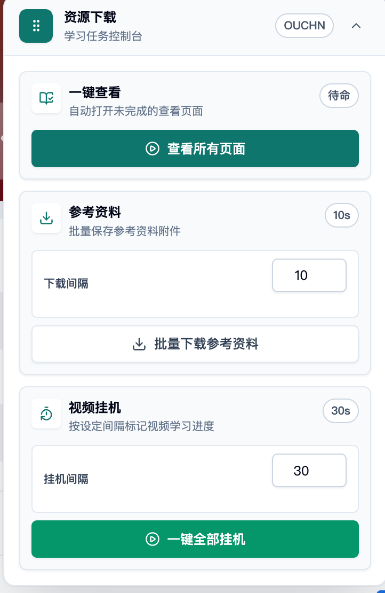
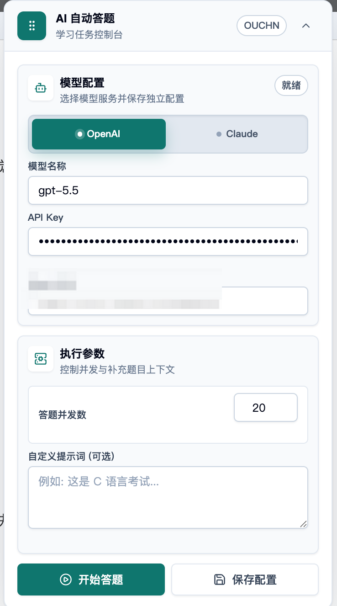

# ouchn-learn

`ouchn-learn` 是一个面向国家开放大学 (OUCHN) 学习平台的 Tampermonkey 用户脚本。它把课程页自动查看、视频挂机、参考资料下载、全屏学习资源保存，以及考试页 AI 自动答题整合在一个浏览器脚本中。

当前代码已经从旧版 jQuery 字符串面板迁移到 React 19 渲染器：界面由 React 组件负责，状态由 Zustand 管理，课程自动化和考试自动答题通过 `src/services/*` 适配到浏览器 DOM 自动化模块。产物仍然是单文件 IIFE UserScript，运行在浏览器 + Tampermonkey 沙箱中。

## 运行效果

| 课程页控制台                                                                                            | AI 自动答题                                                                                    |
| ------------------------------------------------------------------------------------------------------- | ---------------------------------------------------------------------------------------------- |
|  |  |

## 核心功能

- **课程页控制台**: 进入课程页后自动挂载可拖动、可折叠的 React 面板。
- **一键查看页面**: 自动打开未完成的查看页面任务，完成后返回课程页继续扫描。
- **视频挂机**: 批量查找视频学习活动，按配置间隔提交学习进度。
- **参考资料下载**: 展开课程目录，收集附件资源并按间隔触发下载。
- **全屏资源保存**: 在学习活动全屏页展开资源树，保存视频和文档资源，文档可转 PDF。
- **AI 自动答题**: 支持 OpenAI/Claude 兼容接口、独立 Provider 配置、并发答题、图片题降级、工具化 DOM 回填和执行统计。
- **配置迁移与安全存储**: AI API Key 优先写入 Tampermonkey GM 存储，兼容旧版 localStorage 配置迁移。

## 目标页面

- `https://lms.ouchn.cn/course/**`: 课程页，支持自动查看、视频挂机、参考资料下载。
- `https://lms.ouchn.cn/course/**/learning-activity/full-screen#/**`: 全屏学习活动页，支持批量保存学习资源。
- `https://lms.ouchn.cn/exam/*/subjects*`: 考试答题页，支持 AI 自动答题。

## 安装使用

1. 安装 Tampermonkey。
2. 获取发布版用户脚本，或本地执行 `pnpm run build` 生成 `dist/index.global.js`。
3. 在 Tampermonkey 中安装脚本。
4. 访问 OUCHN 课程页、全屏学习活动页或考试页，脚本会根据 URL 自动切换面板模式。

## 使用流程

### 课程页

课程页面板提供三类任务：

1. **查看所有页面**: 扫描未完成查看任务，自动进入页面并返回课程页。
2. **批量下载参考资料**: 按下载间隔展开章节并保存附件。
3. **一键全部挂机**: 按挂机间隔标记视频学习进度。

### 全屏学习活动页

进入学习活动全屏页后，面板切换为保存资源模式：

1. 点击保存所有学习资源。
2. 脚本展开左侧资源树并逐项处理。
3. 视频资源走文件保存，文档资源通过 `jsPDF` + `html2canvas` 转为 PDF。

### 考试页

考试页面板提供 OpenAI 和 Claude 两套独立配置：

1. 选择 Provider。
2. 填写模型名称、API Key、Base URL。
3. 设置答题并发数和可选自定义提示词。
4. 点击保存配置或开始答题。
5. 面板展示状态、填写数量和工具执行统计。

Provider 只负责生成答案；真实页面填写由本地工具层校验并执行，避免模型直接操作 DOM。

## 架构概览

```text
src/
├── index.ts                  # UserScript 入口，注入样式并挂载 React renderer
├── renderer/                 # React 面板、页面模式识别、拖拽 hook、基础 UI
├── store/                    # Zustand stores：课程、考试、面板状态
├── services/                 # React UI 与业务模块之间的适配层
├── modules/                  # 课程自动化、资源保存、AI 答题等业务模块
│   ├── auto-view.ts          # 自动查看页面
│   ├── auto-hang.ts          # 视频挂机
│   ├── auto-material-download.ts
│   ├── save-resources/
│   ├── resource-download.ts
│   ├── legacy-hang.ts
│   ├── styles.ts             # scoped runtime CSS / Tailwind-like utilities
│   └── exam/                 # AI 自动答题链路
├── utils/                    # DOM、存储、页面运行时、通用工具
├── constants/                # 默认 Provider 配置和常量
└── types/                    # 公共类型
```

### 分层职责

- `src/renderer/mount.tsx` 负责创建单一 React root，并通过 URL 监听和轮询识别当前页面模式。
- `src/renderer/App.tsx` 根据页面模式渲染 `CoursePanel`、`FullScreenPanel` 或 `ExamPanel`。
- `src/store/*` 保存 UI 状态、任务配置和执行状态。
- `src/services/*` 把 React/Zustand action 转换为业务模块调用，避免组件直接编排复杂 DOM 流程。
- `src/modules/*` 保留浏览器脚本式自动化逻辑，负责扫描 OUCHN 页面、读写 DOM、下载资源和执行答题工具。
- `src/utils/storage.ts` 统一处理 localStorage 与 Tampermonkey GM 存储。

## AI 自动答题链路

核心入口是 `src/services/exam-runner.ts`：

1. `question-extract.ts` 等待题目 DOM 稳定并提取结构化 `Question[]`。
2. `question-detect.ts` 判断题型、过滤装饰图，并识别图片题。
3. `ai-provider.ts` 按题并发调用 OpenAI 或 Claude Provider。
4. Provider 适配器通过 `provider-http.ts` 统一处理 `fetch`、`GM_xmlhttpRequest` 和重试。
5. `tool-executor.ts` 将 AI 答案转换为本地 `ExamToolUse[]`。
6. `tool-registry.ts` 按题型校验工具输入并分派执行。
7. `answer-write.ts`、`answer-fill.ts`、`answer-match.ts` 处理单选、多选、填空、简答和匹配题写入。
8. `ExamStats` 汇总提取数量、AI 返回数量、工具成功/失败、跳过题目和图片降级情况。

这条链路把“模型推理”和“页面执行”分开，便于定位 Provider 问题、题型解析问题和 DOM 写入问题。

## 配置与存储

- 课程自动化状态、返回 URL、课程配置和参考资料缓存仍使用 localStorage，方便跨页面跳转恢复任务。
- AI 答题配置通过 `src/utils/storage.ts` 统一读写。
- API Key 优先保存到 `GM_setValue`，读取时优先使用 `GM_getValue`。
- 旧版 localStorage 中的 AI 配置会在读取时归一化，并迁移到 GM 存储。
- OpenAI 和 Claude 的模型、API Key、Base URL 独立保存，切换 Provider 不会覆盖另一套配置。

## 技术栈

- TypeScript，target ES2020
- React 19 + React DOM
- Zustand
- jQuery，用于兼容 OUCHN 页面和既有 DOM 自动化
- tsup，IIFE/UserScript 构建
- jsPDF + html2canvas，文档资源 PDF 保存
- ESLint flat config + React Doctor + Prettier + Husky + lint-staged

## 质量门禁

- `pnpm run lint` 使用 ESLint flat config，并启用 `eslint-plugin-react-doctor` 推荐规则。
- `pnpm run lint` 和 `pnpm run lint:fix` 都带 `--max-warnings=0`，ESLint warning 会阻塞 CI 和本地检查。
- `lint-staged` 对 `*.{ts,tsx}` 执行 Prettier、`eslint --fix --max-warnings=0` 和 `tsc --noEmit`。
- 当前项目关闭了不适用的 React Doctor 规则，例如 SSR/server/hydration、React Compiler、未使用生态规则和 DOM 自动化串行 await 微优化规则。

## 本地开发

```bash
pnpm install
pnpm run dev
pnpm run build
pnpm run typecheck
pnpm run lint
pnpm run lint:fix
pnpm run format
```

`pnpm run build` 会输出带 UserScript header 的 `dist/index.global.js`。`dist/` 已被 `.gitignore` 忽略。

## UserScript 能力

构建配置在 `tsup.config.ts` 中维护 UserScript header：

- `@match https://lms.ouchn.cn/course/**`
- `@match https://lms.ouchn.cn/exam/*/subjects*`
- `@grant GM_download`
- `@grant GM_getValue`
- `@grant GM_setValue`
- `@grant GM_xmlhttpRequest`
- `@grant unsafeWindow`
- `@connect *`

新增 Tampermonkey API 或外部请求目标时，需要同步检查 `@grant` 和 `@connect`。

## 常见问题

- **面板没有出现**: 确认 Tampermonkey 已启用脚本，并且 URL 命中 `@match`。
- **课程任务没有继续执行**: 自动查看和资源保存依赖页面跳转状态，执行期间不要刷新或手动切换页面。
- **参考资料下载失败**: 检查浏览器下载权限、Tampermonkey 下载权限和课程资源是否需要登录态。
- **AI 配置保存失败**: 确认脚本 grant 中包含 `GM_getValue` 和 `GM_setValue`，并重新安装最新构建产物。
- **AI 答题为空或部分跳过**: 检查 Provider Base URL、模型名称、API Key、并发数，以及浏览器控制台中的 `ExamStats`。
- **匹配题填写失败**: OUCHN 匹配题 DOM 形态差异较大，脚本会依次尝试 Angular model、拖拽、点击匹配和隐藏输入等策略，最终结果以面板统计为准。

## 注意事项

- 本脚本仅供学习交流使用。
- 项目运行环境是浏览器 + Tampermonkey，不存在 Node.js 运行时。
- 业务代码不要直接使用 Node.js 专属 API，例如 `fs`、`path`、`process`。
- 涉及持久化时优先复用 `src/utils/storage.ts`。
- 涉及 DOM 操作时优先检查 `src/utils/dom.ts`。
- 保存资源或 AI 答题期间，不建议手动刷新、关闭或切换页面。

## License

MIT
